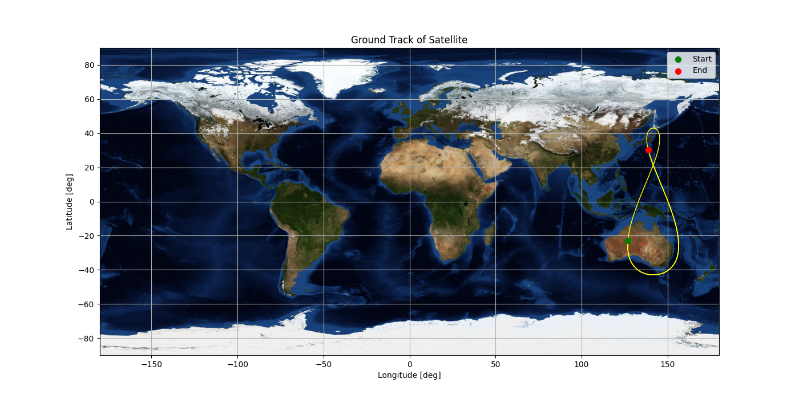
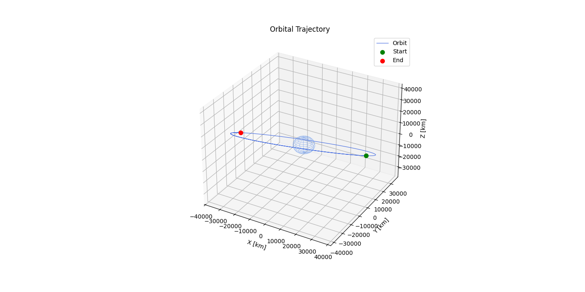
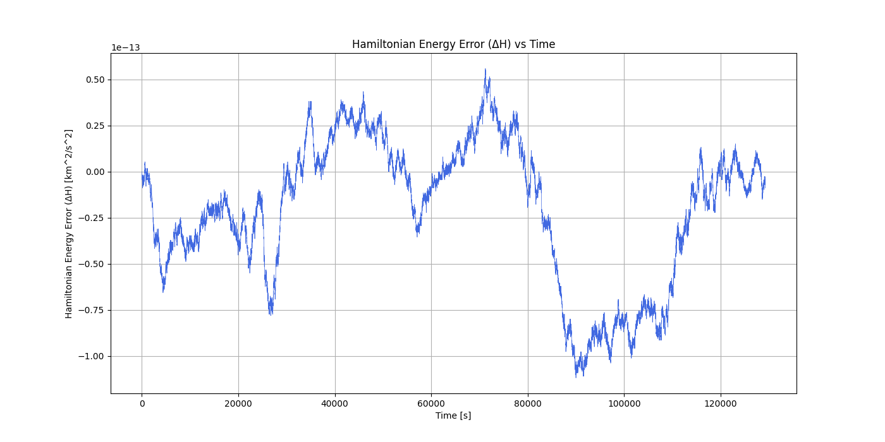

# Restricted 2-Body Problem Solver

A numerical orbital mechanics simulator using a 4th-order Yoshida symplectic integrator, with J2 perturbation support, ground track visualization, and ECI/ECEF coordinate transformations.

---

## Features

- **4th-order Yoshida symplectic integrator** — preserves Hamiltonian energy to near machine precision
- **J2 perturbation model** — oblateness correction to the gravitational potential
- **Orbital elements → state vector conversion** — full perifocal-to-ECI rotation via Curtis eq. 4.48
- **Ground track plotting** — ECI to ECEF transformation with Earth rotation, displayed on a world map
- **3D orbit visualization** — trajectory plotted against a wireframe Earth sphere
- **Energy and angular momentum error tracking** — validates integration accuracy over time
- **Julian date and Greenwich Sidereal Time computation** — epoch-accurate ground track positioning

---

## Requirements

```
numpy
pandas
matplotlib
```

Install with:

```bash
pip install numpy pandas matplotlib
```

An optional `earth.jpg` background image can be placed in the working directory for the ground track plot. A suitable image is available at Reference [4] below.

---

## Usage

Edit the inputs section of the script directly:

```python
# Orbital elements
zp    = 32623.6          # Periapsis altitude [km]
e     = 0.075            # Eccentricity
i     = np.radians(43.0) # Inclination [deg]
raan  = np.radians(195.0)# Right ascension of ascending node [deg]
argp  = np.radians(270.0)# Argument of periapsis [deg]
theta = np.radians(305.0)# True anomaly [deg]

# Initial epoch (UTC)
date    = np.array([12, 26, 2009])  # [mm, dd, yyyy]
timeUTC = np.array([12, 0, 0])      # [hh, mm, ss]

# Simulation
stepsPerOrbit = 10000
numOrbits     = 1.5
perturbed     = True
```

Run with:

```bash
python R2BP.py
```

---

## Outputs

The script prints to console and generates three plots:

**Console**
- Simulation runtime
- Semi-major axis, orbital period, time step
- Julian date and Greenwich Sidereal Time at epoch
- Starting and final latitude/longitude
- Max and mean Hamiltonian energy error |ΔH|
- Max and mean angular momentum error |ΔL|

**Plots**
- 3D orbital trajectory in ECI frame
- Ground track in ECEF frame overlaid on world map
- Hamiltonian energy error vs time
- Angular momentum error vs time

---

## Example Output
### QZSS Tundra Orbit — 1.5 orbits from 12/26/2009 12:00:00 UTC
```
------------------------- Running -------------------------
Simulation time:                     0.662 seconds
Perturbed:                           True
Total orbits:                        1.5
Semi-major axis (a):                 42164.040 km
Orbital period (T):                  86163.693 seconds
Time step (dt):                      8.616 seconds
------------------------ Results --------------------------
Initial epoch:                       12/26/2009 12:00:00 UTC
Julian date at epoch:                2455192.0
Greenwich sidereal time (epoch):     275.117 deg
Starting latitude:                   -23.028 deg
Starting longitude:                  127.000 deg
Final latitude:                      30.349 deg
Final longitude:                     138.794 deg
Max |ΔH|:                            1.119e-13 km^2/s^2
Mean |ΔH|:                           3.307e-14 km^2/s^2
Max |ΔL|:                            1.608e+00 km^2/s
Mean |ΔL|:                           7.478e-01 km^2/s^2
------------------------ See Plots ------------------------
--------------------- Script Concluded --------------------
```
### Ground Track

### 3D Trajectory

### Hamiltonian Energy Conservation

---


## Recommended Simulation Settings

| Orbit Type   | stepsPerOrbit | Expected \|ΔH\|  |
|:-------------|:-------------:|:----------------:|
| Circular LEO | 1,000         | ~1E-12           |
| Molniya      | 100,000       | ~1E-10           |
| Tundra       | 10,000        | ~1E-12           |

---

## Example Orbits

Three pre-configured examples are included as commented blocks at the bottom of the script:

- **LEO Sun-Synchronous Orbit** — 520 km circular, i = 97.45°
- **Molniya orbit** — 500 km periapsis, e = 0.74, i = 63.43°
- **QZSS Tundra orbit** — 32,623.6 km periapsis, e = 0.075, i = 43°, modeled after QZS-1 at its Dec 26 2009 epoch

---

## Perturbation Model

When `perturbed = True`, the acceleration includes the J2 zonal harmonic:

$$\mathbf{a}_{J2} = \frac{3}{2} \frac{J_2 \mu R_E^2}{r^5} \begin{bmatrix} x\left(5\frac{z^2}{r^2}-1\right) \\ y\left(5\frac{z^2}{r^2}-1\right) \\ z\left(5\frac{z^2}{r^2}-3\right) \end{bmatrix}$$

with $J_2 = 1.08263 \times 10^{-3}$. The corresponding J2 potential correction is included in the Hamiltonian energy tracking. Angular momentum **is not conserved** under this perturbation.

---

## Limitations

- Periodic orbits only (0 ≤ e < 1) — hyperbolic trajectories not supported
- J2 is the only perturbation — lunar/solar third-body effects are not modeled (significant above ~20,000 km)
- Spherical Earth assumed for latitude/longitude — geodetic corrections not applied
- Single body only — no maneuvers or multi-body dynamics

---

## References

[1] Yoshida, H. (1990). "Construction of higher order symplectic integrators." *Physics Letters A*, 150(5–7), 262–268.

[2] Curtis, H.D. (2021). *Orbital Mechanics for Engineering Students*. 4th ed. Butterworth-Heinemann.

[3] Bate, R.R., Mueller, D.D. & White, J.E. (1971). *Fundamentals of Astrodynamics*. Dover Publications.

[4] NASA Earth Observatory — world topography background image: https://eoimages.gsfc.nasa.gov/images/imagerecords/73000/73909/world.topo.bathy.200412.3x5400x2700.jpg

[5] JPL Solar System Dynamics — planetary parameters: https://ssd.jpl.nasa.gov/astro_par.html
